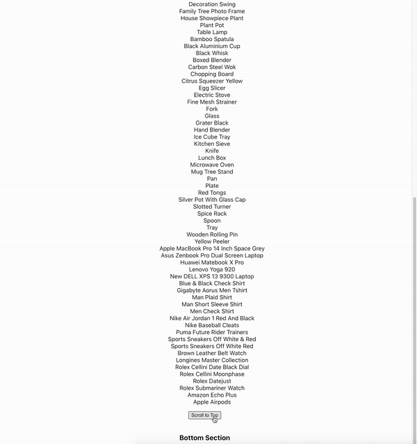
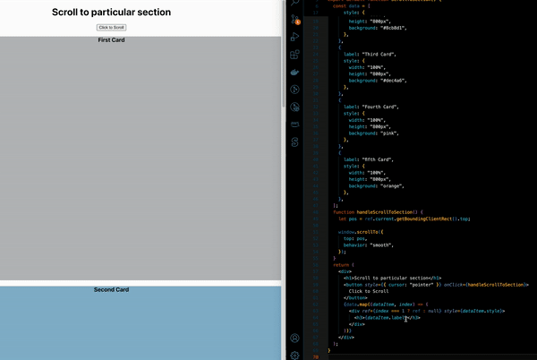

# Scroll-To-Sections-Project

index.js
import useFetchCustomHook from "../components/useFetch/index";

export default function ScrollToTopAndBottom() {
  const { data, error, pending } = useFetchCustomHook(
    "https://dummyjson.com/products?limit=100",
    {}
  );

  if (pending) {
    return <h2>Loading...</h2>;
  }
  if (error) {
    return <h2>Error occured! please try again!</h2>;
  }
  return (
    

      <h1>Scroll to Top & Bottom Feature</h1>
      <h3> Top Section</h3>
      <button style={{ cursor: "pointer" }}>Scroll to Bottom</button>

      <ul style={{ listStyle: "none" }}>
        {data && data.products && data.products.length > 0 ? (
          data.products.map((item) => <li key={item.id}>{item.title}</li>)
        ) : (
          <li>No products found</li>
        )}
      </ul>

      <button style={{ marginBottom: "20px", cursor: "pointer" }}>
        Scroll to Top
      </button>
      <h3>Bottom Section</h3>
    

  );
}

with that you can see that the products titles are displayed in the page 

now we want when we click on buttons we scroll either to Top and Bottom

we need to create two functions to be passed to button on Click

handleScrollToTop and handleScrollToBottom 

for the button to scroll to top 
  <button
        onClick={handleScrollToTop}
        style={{ marginBottom: "20px", cursor: "pointer" }}
      >
        Scroll to Top
      </button>

and we create the function 
  function handleScrollToTop() {
    window.scrollTo({
        top: 0, left: 0, behavior: 'smooth'
    })
  }

But for the button to scroll to bottom we need a Reference 

so we need to use useRef Hook

import { useRef } from "react";

 const bottomRef = useRef(null);

  function handleScrollToBottom() {
    bottomRef.current.scrollIntoView({behavior: 'smooth'})
  }

now add the Ref down in the code to connect it like

  

so the ScrollToTopAndBottom should be like

import { useRef } from "react";
import useFetchCustomHook from "../components/useFetch/index";

export default function ScrollToTopAndBottom() {
  const { data, error, pending } = useFetchCustomHook(
    "https://dummyjson.com/products?limit=100",
    {}
  );
  const bottomRef = useRef(null);
  function handleScrollToTop() {
    window.scrollTo({
      top: 0,
      left: 0,
      behavior: "smooth",
    });
  }
  function handleScrollToBottom() {
    bottomRef.current.scrollIntoView({ behavior: "smooth" });
  }
  if (pending) {
    return <h2>Loading...</h2>;
  }
  if (error) {
    return <h2>Error occured! please try again!</h2>;
  }

  return (
    

      <h1>Scroll to Top & Bottom Feature</h1>
      <h3> Top Section</h3>
      <button onClick={handleScrollToBottom} style={{ cursor: "pointer" }}>
        Scroll to Bottom
      </button>

      <ul style={{ listStyle: "none" }}>
        {data && data.products && data.products.length > 0 ? (
          data.products.map((item) => <li key={item.id}>{item.title}</li>)
        ) : (
          <li>No products found</li>
        )}
      </ul>

      <button
        onClick={handleScrollToTop}
        style={{ marginBottom: "20px", cursor: "pointer" }}
      >
        Scroll to Top
      </button>
      

      <h3>Bottom Section</h3>
    

  );
}

with that both Scroll to Top and Bottom buttons are working to go to the top of the page and to the bottom of the page

But what if you want to go to certain section of the page?

Based on Reference we trigger the section we want to scroll to

lets create another file scrollToSection.jsx 

export default function ScrollToSection() {
  const data = [
    {
      label: "First Card",
      style: {
        width: "100%",
        height: "600px",
        background: "grey",
      },
    },
    {
      label: "Second Card",
      style: {
        width: "100%",
        height: "600px",
        background: "yellow",
      },
    },
    {
      label: "Third Card",
      style: {
        width: "100%",
        height: "600px",
        background: "blue",
      },
    },
    {
      label: "Fourth Card",
      style: {
        width: "100%",
        height: "600px",
        background: "pink",
      },
    },
    {
      label: "fifth Card",
      style: {
        width: "100%",
        height: "600px",
        background: "orange",
      },
    },
  ];
  return (
    

      <h1>Scroll to particular section</h1>
      <button>Click to Scroll</button>
      {data.map((dataItem) => (
        

          <h3>{dataItem.label}</h3>
        

      ))}
    

  );
}

now lets say you want to scroll to fourth card so how you going to do that?

again we have to create Ref

import { useRef } from "react";

  const ref = useRef();

  function handleScrollToSection(){
   let pos = ref.current.getBoundingClientRect().top;

        window.scrollTo({
            top: pos,
            behavior: 'smooth'
        })
  }  

now if we want to scroll for example to card number 4 we make a ref of 3 to the index like that

 

      <h1>Scroll to particular section</h1>
      <button onClick={handleScrollToSection}>Click to Scroll</button>
      {data.map((dataItem, index) => (
        

          <h3>{dataItem.label}</h3>
        

      ))}
    

if we want to scroll to second section we make the index number 1 like that

 

      <h1>Scroll to particular section</h1>
      <button onClick={handleScrollToSection}>Click to Scroll</button>
      {data.map((dataItem, index) => (
        

          <h3>{dataItem.label}</h3>
        

      ))}
    

with that we can target any section with a button to navigate to that section by using Reference to that section
